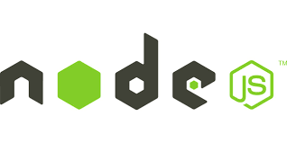
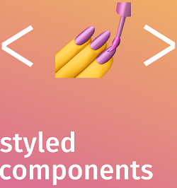

# UNIVESP 2023 Completion of Course Work   Development of a Chat App

## Technologies Used:

## Language:

[Portuguese](/README.md) / [English](/READMEN.md)

## Creation Data:

09/2023

## Goal:

Project developed to meet the criteria established for completion of the course at UNIVESP 2023.

## Packet Generation:

* Before generating the final package, you must run the npm install command in order to install the dependencies;
* Edit the port to be used in the .env file

## Comments:

The final product is in the fullStack/chat folder. The npm install command must be used in the dist folder in order to gather the necessary dependencies for the application to work.

## Author:

Diogo Borges.

## Contact:

diogosbavell@outlook.com.